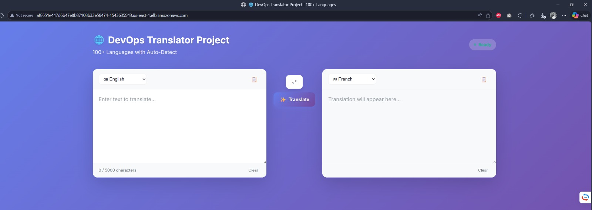
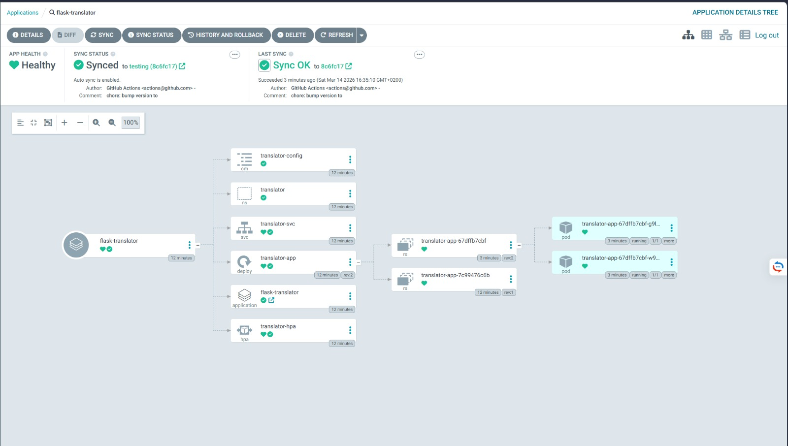
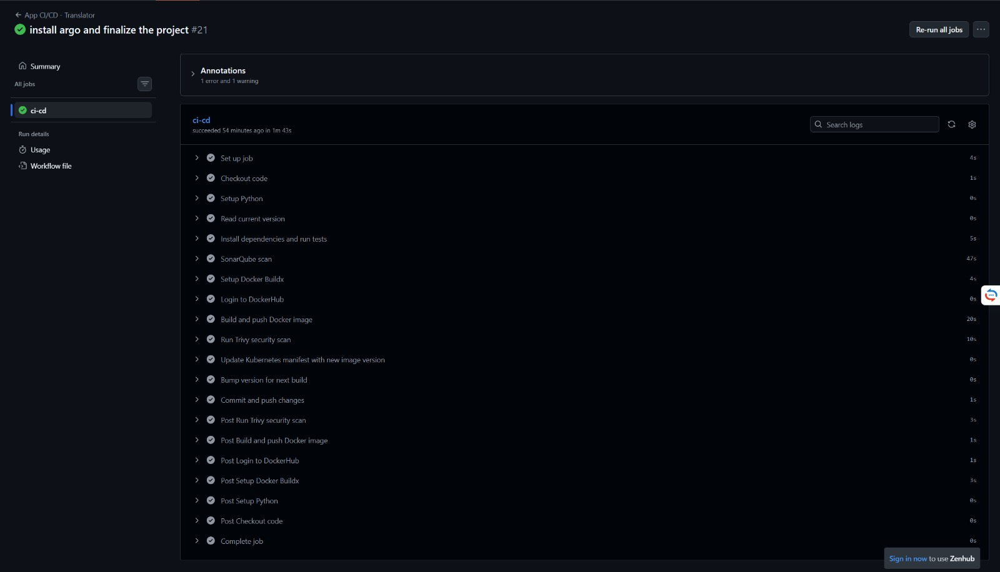

# 🚀 Flask Translator - GitOps DevOps Project

> A production-grade Flask web application with automated CI/CD, GitOps deployment, and AWS EKS infrastructure.


*Figure 1: Flask Translator Web Interface*

---

## 📋 Table of Contents

- [✨ Features](#-features)
- [🏗️ Architecture](#️-architecture)
- [📁 Project Structure](#-project-structure)
- [🚀 Quick Start](#-quick-start)
- [🔄 CI/CD Pipeline Flow](#-cicd-pipeline-flow)
- [🧪 Verification](#-verification)
- [🗑️ Cleanup](#️-cleanup)
- [📊 Screenshots](#-screenshots)
- [🔗 Links](#-links)

---

## ✨ Features

| Feature | Description |
|---------|-------------|
| 🌍 **100+ Languages** | Translate text between all major world languages |
| 🔁 **GitOps Deployment** | ArgoCD auto-syncs changes from Git to EKS |
| 🔄 **Automated CI/CD** | GitHub Actions: test → scan → build → deploy |
| 🔐 **Security-First** | Trivy + SonarCloud scanning in pipeline |
| 📊 **Monitoring** | CloudWatch metrics + SNS email alerts |
| 💰 **Cost-Conscious** | Full cleanup with $0 residual charges |
| 📝 **Documented** | Professional READMEs + architecture diagram |

---

## 🏗️ Architecture

```
Developer → GitHub → GitHub Actions → DockerHub → ArgoCD → EKS → Users
                              ↓
                        Terraform → AWS (VPC, EKS, S3, CloudWatch)
```

### Components

| Layer | Tool | Purpose |
|-------|------|---------|
| **Infrastructure** | Terraform | Provision AWS EKS + VPC + monitoring |
| **CI/CD** | GitHub Actions | Build, test, scan, push Docker image |
| **GitOps** | ArgoCD | Auto-sync manifests from Git to Kubernetes |
| **Application** | Flask + Docker | Translation service (100+ languages) |
| **Monitoring** | CloudWatch + SNS | Metrics + email alerts |

---

## 📁 Project Structure

```
flask_translator/
├── .github/workflows/
│   ├── application.yml      # App CI/CD pipeline
│   ├── infrastructure.yml   # Terraform pipeline (manual trigger)
│   └── README.md            # Workflow documentation
│
├── application/
│   ├── app/                 # Flask application code
│   ├── tests/               # Unit tests (pytest)
│   ├── Dockerfile           # Multi-stage build
│   ├── requirements.txt     # Python dependencies
│   └── README.md            # App documentation
│
├── kubernetes/
│   ├── namespace.yaml       # translator namespace
│   ├── configmap.yaml       # App configuration
│   ├── deployment.yaml      # Flask deployment
│   ├── service.yaml         # LoadBalancer service
│   ├── hpa.yaml             # Horizontal Pod Autoscaler
│   ├── argocd-app.yaml      # ArgoCD Application manifest
│   └── README.md            # K8s documentation
│
├── terraform/
│   ├── main.tf              # VPC + EKS + monitoring
│   ├── variables.tf         # Input variables
│   ├── outputs.tf           # Exported values
│   ├── providers.tf         # AWS provider + S3 backend
│   └── README.md            # Infra documentation
│
├── docs/
│   └── screenshots/         # Project screenshots
│       ├── app-ui.png
│       ├── pipeline-success.png
│       └── argocd-synced.png
│
├── VERSION                  # Semantic version (auto-bumped)
└── README.md                # This file
```

---

## 🚀 Quick Start

### Prerequisites

| Tool | Install Command |
|------|----------------|
| AWS CLI | `winget install Amazon.AWSCLI` |
| kubectl | `winget install kubectl` |
| Terraform | `winget install HashiCorp.Terraform` |
| Git | `winget install Git.Git` |

### Step 1: Provision Infrastructure (Terraform)

#### Option A: Manual (Recommended for First Time)
```powershell
cd terraform

# Configure AWS credentials
aws configure

# Initialize and apply
terraform init
terraform plan
terraform apply -auto-approve
```

#### Option B: GitHub Actions (Manual Trigger)
1. Go to: `https://github.com/AhmeFawzy/flask_translator/actions`
2. Click **"Infra - Terraform"** → **"Run workflow"**
3. Select: `environment: testing`, `action: apply`
4. Click **"Run workflow"**

> ⚠️ **Wait 5-10 minutes** for EKS cluster and nodes to provision.

---

### Step 2: Connect kubectl to EKS

```powershell
# Configure kubectl
aws eks update-kubeconfig --region us-east-1 --name translator-eks

# Verify connection (should show 2 nodes)
kubectl get nodes
```

**Expected Output:**
```
NAME                        STATUS   ROLES    AGE   VERSION
ip-10-0-3-xxx.ec2.internal  Ready    <none>   5m    v1.30.x
ip-10-0-4-xxx.ec2.internal  Ready    <none>   5m    v1.30.x
```

---

### Step 3: Install ArgoCD (GitOps Controller)

```powershell
# Create ArgoCD namespace
kubectl create namespace argocd

# Install ArgoCD
kubectl apply -n argocd -f https://raw.githubusercontent.com/argoproj/argo-cd/stable/manifests/install.yaml

# Wait for pods to be Running (2-3 minutes)
kubectl get pods -n argocd --watch
```

**Press `Ctrl+C` when all pods show `Running`.**

---

### Step 4: Apply ArgoCD Application Manifest

```powershell
# This tells ArgoCD to watch your GitHub repo
kubectl apply -f kubernetes/argocd-app.yaml
```

**Expected Output:**
```
application.argoproj.io/flask-translator created
```

---

### Step 5: Verify Deployment

```powershell
# Check ArgoCD sync status
kubectl get applications -n argocd

# Check app pods (wait 2-3 mins for ArgoCD to sync)
kubectl get pods -n translator

# Get LoadBalancer URL
kubectl get svc translator-svc -n translator --watch
```

**Wait for `EXTERNAL-IP` to appear (2-5 minutes).**

---

### Step 6: Access Your Application

```powershell
# Get the LoadBalancer URL
$LB_URL = kubectl get svc translator-svc -n translator -o jsonpath='{.status.loadBalancer.ingress[0].hostname}'

# Print and open
echo $LB_URL
start http://$LB_URL
```


*Figure 2: Flask Translator Running on EKS*

---

### Step 7: Access ArgoCD UI

```powershell
# Get ArgoCD admin password
$ARGO_PASS = kubectl -n argocd get secret argocd-initial-admin-secret -o jsonpath="{.data.password}" | base64 -d
echo $ARGO_PASS

# Port-forward to access UI
kubectl port-forward svc/argocd-server -n argocd 8080:443
```

**Keep terminal open, then:**

1. Open: `https://localhost:8080`
2. Accept security warning (self-signed cert)
3. Login:
   - **Username:** `admin`
   - **Password:** (output from `$ARGO_PASS`)


*Figure 3: ArgoCD Showing Synced + Healthy*

---

## 🔄 CI/CD Pipeline Flow

### What Happens When You Push to `testing` Branch

```
1. Developer pushes code to 'testing' branch
   ↓
2. GitHub Actions triggers (application.yml)
   ↓
3. Pipeline Stages:
   ├── ✅ Checkout code
   ├── ✅ Setup Python 3.11
   ├── ✅ Run pytest tests
   ├── ✅ SonarCloud code quality scan
   ├── ✅ Build Docker image (multi-stage)
   ├── ✅ Trivy security vulnerability scan
   ├── ✅ Push image to DockerHub (flokibaots/translator-app:VERSION)
   ├── ✅ Update kubernetes/deployment.yaml with new image tag
   ├── ✅ Bump VERSION file (1.0.14 → 1.0.15)
   └── ✅ Commit + push changes back to GitHub
   ↓
4. ArgoCD detects manifest change (~2-3 minutes)
   ↓
5. ArgoCD auto-syncs to EKS cluster
   ↓
6. Kubernetes pulls new Docker image
   ↓
7. Old pods terminated, new pods created (zero downtime)
   ↓
8. ✅ App updated with new version!
```


*Figure 4: GitHub Actions Pipeline Completed Successfully*

---

## 🧪 Verification

### Verify App Is Running

```powershell
# Check pods
kubectl get pods -n translator

# Check service URL
kubectl get svc -n translator

# Test health endpoint
$LB_URL = kubectl get svc translator-svc -n translator -o jsonpath='{.status.loadBalancer.ingress[0].hostname}'
curl http://$LB_URL/health
# Expected: {"status": "healthy"}
```

### ✅ Verify Image Version Was Bumped

```powershell
# Check the image tag of running pods
kubectl get pods -n translator -o jsonpath='{.items[0].spec.containers[0].image}'

# Expected output:
# flokibaots/translator-app:1.0.15
```

> This confirms the pipeline successfully:
> 1. Built the new Docker image
> 2. Pushed to DockerHub with new version tag
> 3. Updated the Kubernetes manifest
> 4. ArgoCD synced the change to EKS

### Verify ArgoCD Sync Status

```powershell
kubectl get applications -n argocd
```

**Expected:**
```
NAME               SYNC STATUS   HEALTH STATUS
flask-translator   Synced        Healthy
```

---

## 🗑️ Cleanup: Destroy Everything

### Step 1: Delete Kubernetes Resources
```powershell
kubectl delete -f kubernetes/
kubectl delete namespace translator
kubectl delete namespace argocd
```

### Step 2: Destroy Terraform Infrastructure
```powershell
cd terraform
terraform destroy -auto-approve
```

### Step 3: Clean Up S3 + DynamoDB
```powershell
# Empty and delete S3 bucket
aws s3 rm s3://translator-app-tfstate --recursive --region us-east-1
aws s3 rb s3://translator-app-tfstate --force --region us-east-1

# Delete DynamoDB table
aws dynamodb delete-table --table-name terraform-locks --region us-east-1
```

### Step 4: Verify Everything Is Gone
```powershell
# Check for remaining resources
aws eks list-clusters --region us-east-1                    # Should be []
aws ec2 describe-instances --region us-east-1 --query 'Reservations[].Instances[?State.Name==`running`].InstanceId'  # Should be []
aws s3 ls | findstr translator                               # Should be (no output)
```

✅ **Result: $0 ongoing AWS charges**

---

## 📊 Screenshots

### App Interface

*Flask Translator web interface with 100+ language support*

### CI/CD Pipeline Success

*GitHub Actions pipeline: tests → scans → build → deploy*

### ArgoCD GitOps Sync

*ArgoCD showing Synced + Healthy status*

---

## 🔗 Links

| Resource | Link |
|----------|------|
| 🐙 GitHub Repo | https://github.com/AhmeFawzy/flask_translator |
| 🐳 DockerHub Image | https://hub.docker.com/r/flokibaots/translator-app |
| ☸️ ArgoCD Docs | https://argoproj.github.io/argo-cd/ |
| 🏗️ Terraform AWS Provider | https://registry.terraform.io/providers/hashicorp/aws |
| 🔄 GitHub Actions Docs | https://docs.github.com/en/actions |

---

## 👨‍💻 Author

**Ahmed Fawzy** - DevOps Engineer

- 🔗 GitHub: [@AhmeFawzy](https://github.com/AhmeFawzy)
- 🐳 Docker Hub: [flokibaots/translator-app](https://hub.docker.com/r/flokibaots/translator-app)
- 📧 Email: ahmad.fawzzi@gmail.com

---

## 🙏 Acknowledgments

- [deep-translator](https://github.com/nidhaloff/deep-translator) - Translation library
- [Flask](https://flask.palletsprojects.com) - Web framework
- [ArgoCD](https://argoproj.github.io/argo-cd/) - GitOps controller
- [Terraform AWS Modules](https://registry.terraform.io/modules/terraform-aws-modules) - Reusable infrastructure

---

> 💡 **Tip:** This project demonstrates a complete GitOps workflow. For interviews, focus on:
> 1. The automated pipeline flow (push → deploy)
> 2. Security scanning integration (Trivy + SonarCloud)
> 3. Cost management (full cleanup with $0 residual charges)
> 4. GitOps benefits (self-healing, version-controlled deployments)

---

**🎉 Project Complete!**  
Built with ❤️ using modern DevOps practices.